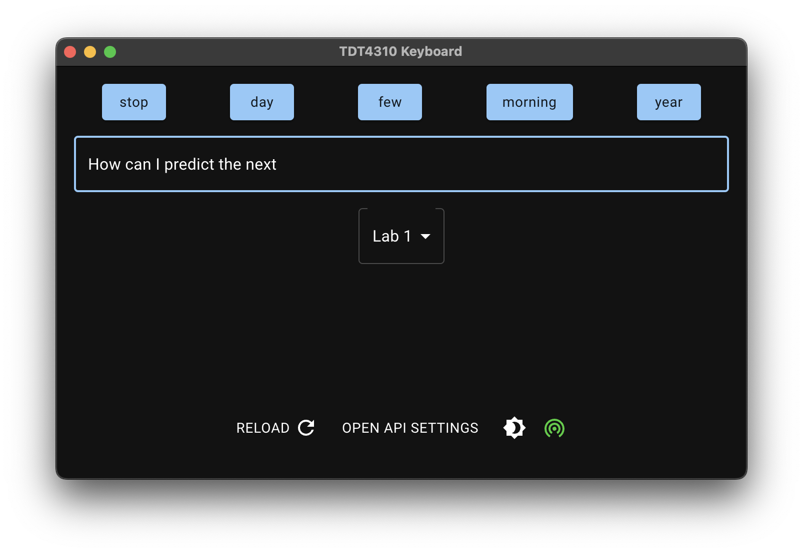
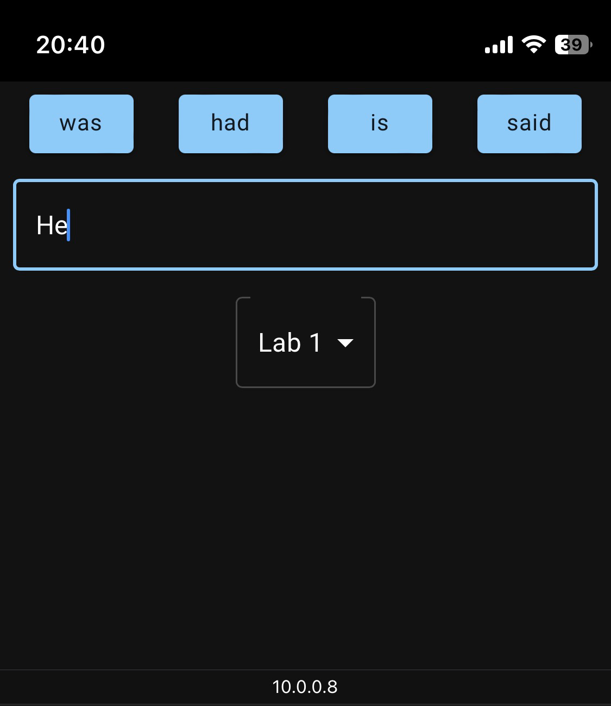

# TDT 4310 - Intelligent Text Analytics and Language Understanding - Spring 2023

This is a space for the labs of TDT4310, including the tasks and supplementary material.

Main points:
1. Labs released every second Friday (see dates below)
2. You get an initial week to work with (and possibly finish) the lab
3. Lab session takes place. I will do my best to assist as many as I can. Note that this is an open session, where I encourage you to talk to your peers and discuss in groups.
4. Deadline is 1 week after the lab session.

For any other questions that may not be suitable for the lab sessions, contact us through the emails provided on blackboard.

## `Curriculum 📚`
This year, the course curriculum is mostly based around the brand new book by *Ekaterina Kochmar* -- Getting Started with Natural Language Processing. For purchasing instructions (+ discount), visit the course page on Blackboard.

    

We'll also use the NLTK library. As usual, more information on textbooks and other resources can be found on blackboard.

## `Labs 📝`
All exercises/labs will follow this format:
- Questions (provided as pdf/markdown) relevant to the current lab (e.g. [LAB_1.pdf](exercises/LAB_1.pdf))
- server code that you will implement to improve the keyboard, found under `labs/your_implementations/lab_n.py`. 

It is highly recommended to complete the initial questions before moving on to the implementation.

**❗️Delivery❗️**
Delivery guidelines are found in each lab. In short, submit a zip file with your NTNU username, containing your answers to the exercises as a document, in addition to a python file with your completed implementation of the lab.

For the exercises, keep your answers short. These questions are meant to guide you towards an understanding of the topics, so that you can focus on the implementation.

Here's a brief overview of the labs

**(topics and dates may change throughout the semester based on feedback and other things)**

| Lab | Link | Published | Deadline | Topic | Smart keyboard features | Libraries | Chapters |
| - | - | - | - | - | - | - | - |
| 1 | [Lab1](exercises/LAB_1.pdf) | Jan. 10 | Jan. 27 | Tokenization, introduction to word vectors and language modeling | Next-word prediction | NLTK | 2, 3 |
| 2 | | Jan. 27 | Feb. 10 | Part-of-speech tagging, stemming/lemmatization, TF-IDF | Utilize part-of-speech for predictions | NLTK, spaCy | 4, 5, 6 |
| 3 | | Feb. 10 | Feb. 24 | Wordnet and SentiWordNet, dependency parsing, POS chunking | Sentiment-based and multi-word predictions | spaCy, Scikit-learn | 7, 8 |
| 4 | | Feb. 24 | Mar. 10 | Unsupervised topic modeling and named entities | Topic-aware predictions | Scikit-learn, Gensim | 9, 10 |

> Note that you can find some useful tips from last year's course here: https://github.com/tollefj/TDT4310-2022

## `The main theme: building a smart keyboard 💻`
Throughout the labs, alongside a few questions and simple tasks, you will be implementing a **smart keyboard**, mostly from scratch. I have prepared a full-stack application, where your task is to build a system that suggests the next word(s).
The frontend application (which you do not need to modify) is built using [**React**](https://reactjs.org/).

**The backend, which you will be working with**, is built using [**Flask**](https://palletsprojects.com/p/flask/). This course assumes fairly good knowledge of programming in general, and you are expected to be able to debug potential issues with the system yourself. I will, of course, do my best to aid you in this process. A screenshot of the application is shown below.

    

The frontend application (running on your PC) is also set up to be exposed on your local network, allowing access from any other device connected to it (either if you're lacking screens, or just for fun!). Below is an example with it accessed from a phone:

    

## `Setup 🛠`
You are required to run a few commands to get the system up and running, both for the frontend and the backend.

### `Backend (Python/Flask server) 🐍`
I suggest you download all packages in NLTK so you can experiment freely without caring about downloading separate packages later on. Data is stored in `nltk_data` in your user folder. The total size is around 3 GB. If you're low on space, look up how to download the packages you require.
- `pip install -r requirements.txt`
- `python -m nltk.downloader all`
### `Frontend (React application) ⚛`

The frontend application runs by doing the following:

- install node, which includes the `npm` cli: https://nodejs.org/en/download/
- `cd labs_frontend`
- `npm install`
- `npm start`

## `Grading 👨‍🏫`
The labs are not graded, but pass/fail. You need to pass all labs to be eligible for the exam. The criteria will be explained further on blackboard and in lectures.

## `Questions and help 🙋‍♂️`
Try to keep questions regarding labs to the lab session. Other questions may be posted on Blackboard.

Some info on the libraries used:
- NLTK has an extensive collection of both explanations and sample usages:
    - https://www.nltk.org/api/nltk.html and https://www.nltk.org/howto.html
- Spacy: https://spacy.io/api
- Scikit-learn: https://scikit-learn.org/stable/modules/classes.html
- Gensim: https://radimrehurek.com/gensim/apiref.html
